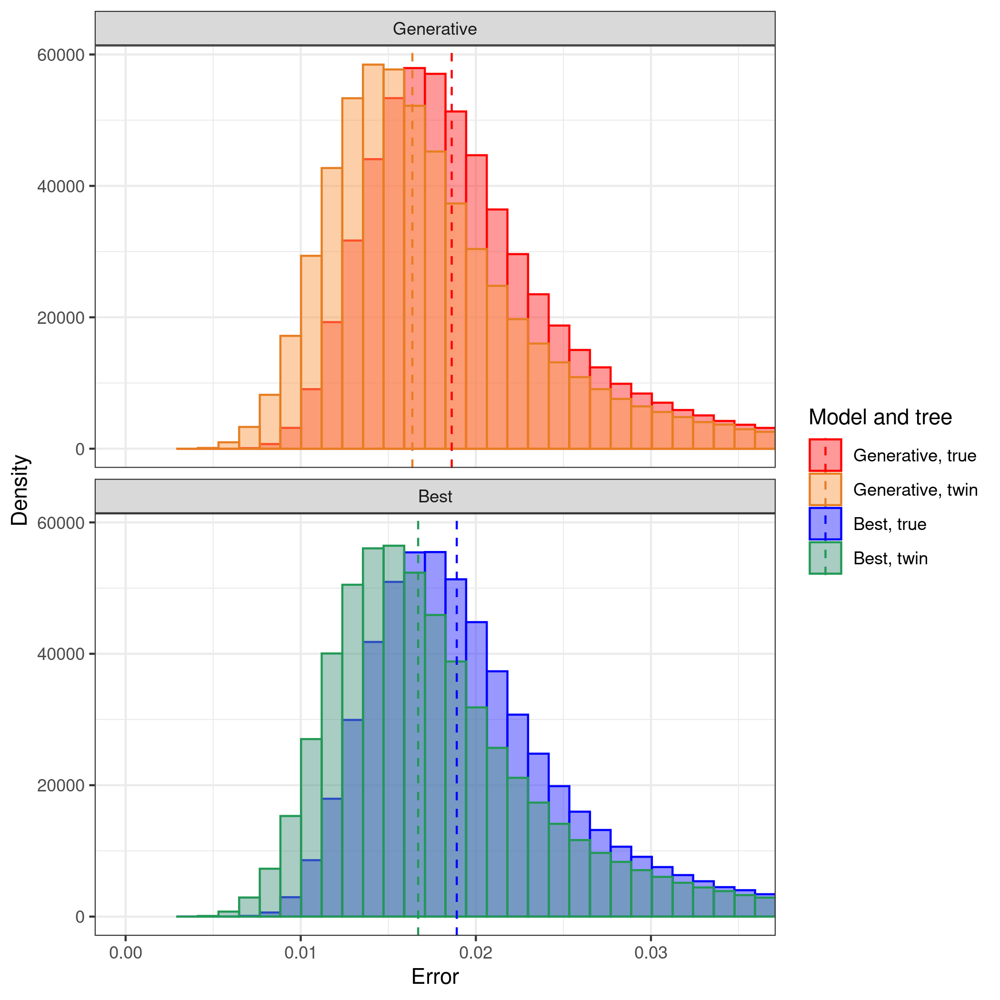

# pirouette_example_41

Branch   |[](https://travis-ci.org)                                                                                                 |[](https://appveyor.com)                                                                                               
---------|--------------------------------------------------------------------------------------------------------------------------------------------------------------|---------------------------------------------------------------------------------------------------------------------------------------------------------------------------------------------
`master` |[](https://travis-ci.org/richelbilderbeek/pirouette_example_41) |.
`develop`|[](https://travis-ci.org/richelbilderbeek/pirouette_example_41)|.

A [pirouette example](https://github.com/richelbilderbeek/pirouette_examples)
that shows the pirouette plot for multiple DD trees, for 12 taxa.

## Running on Peregrine

Install `pirouette` using the [peregrine](https://github.com/richelbilderbeek/peregrine)
bash and R scripts.

Then, in the main folder of this repo, type:

```
sbatch scripts/rerun.sh
```

## Related settings

 * [Use 6 taxa (instead of 12)](https://github.com/richelbilderbeek/pirouette_example_28)
 * [Use 24 taxa (instead of 6)](https://github.com/richelbilderbeek/pirouette_example_33)

## Results

 * Download the intermediate data at 
   [https://www.richelbilderbeek.nl/pirouette_example_41.zip](https://www.richelbilderbeek.nl/pirouette_example_41.zip)



